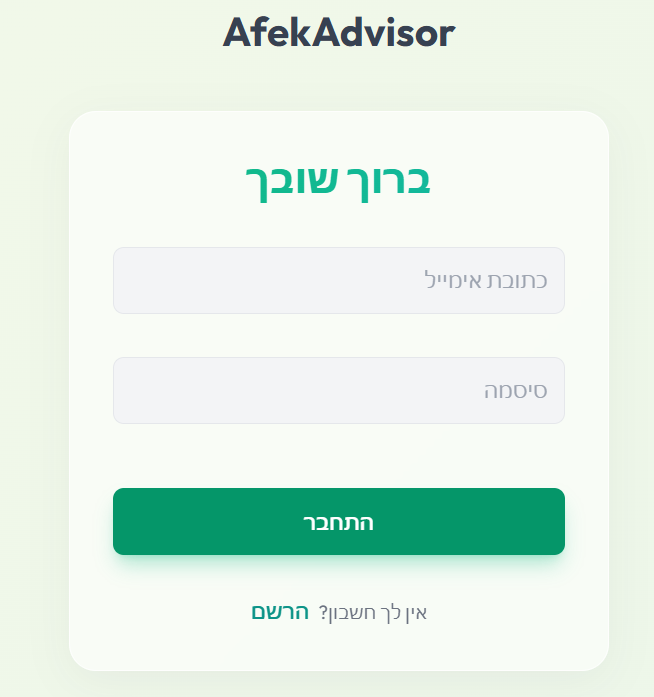
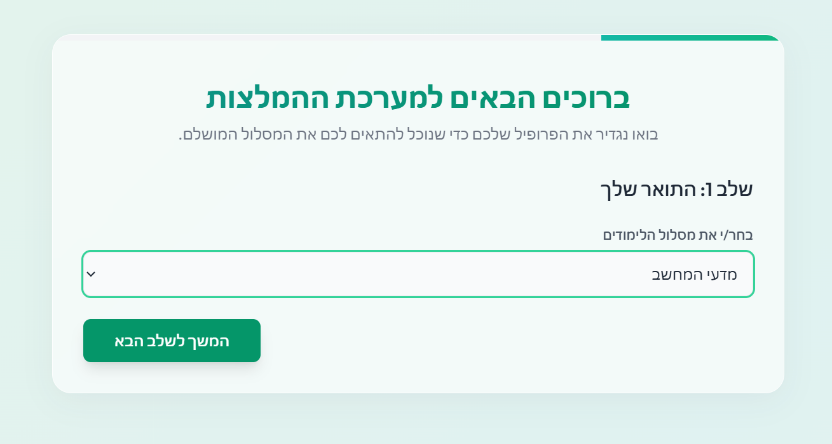
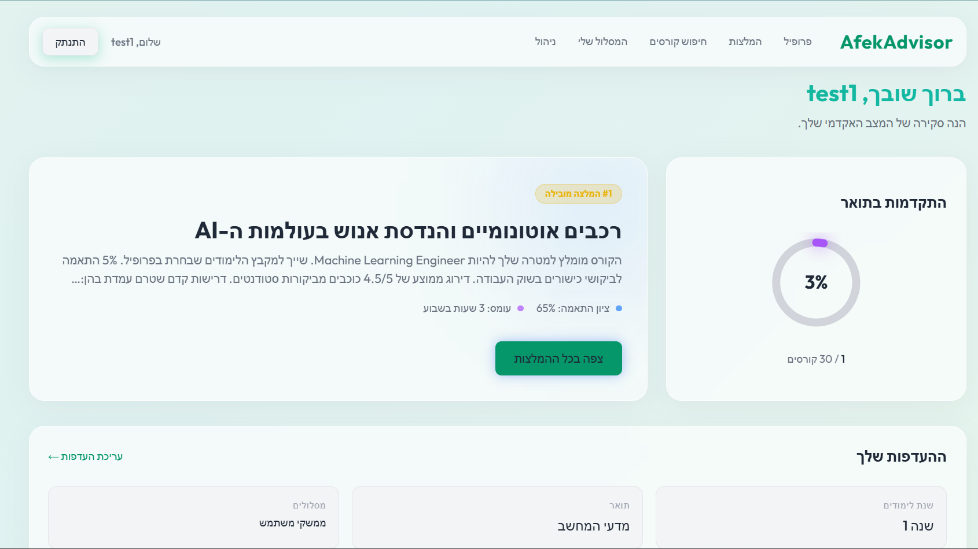
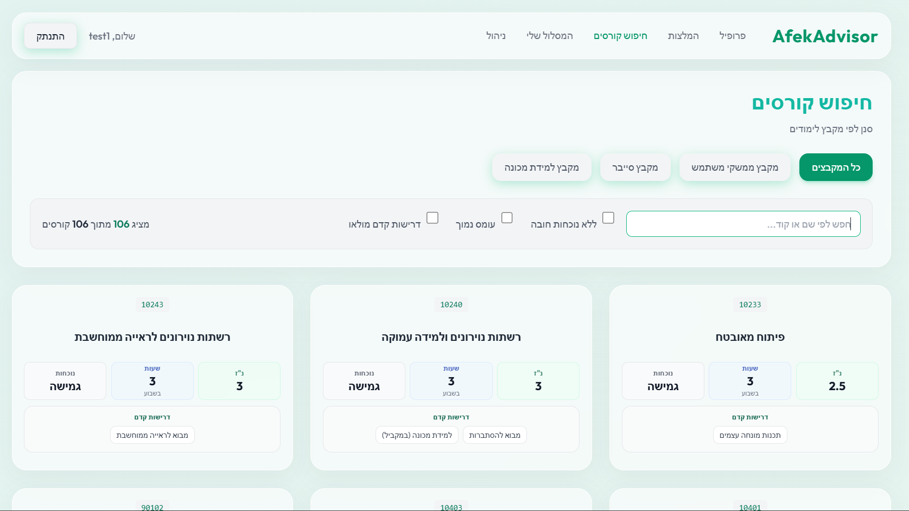
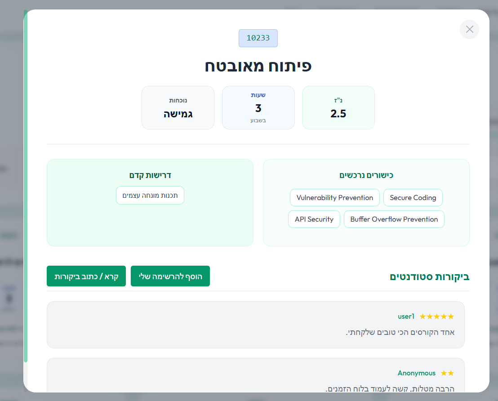
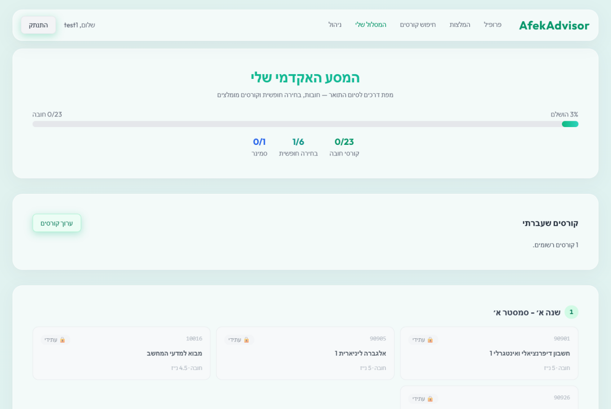
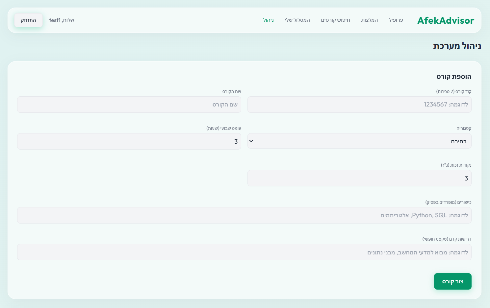

# AfekAdvisor — Course Recommendation System

A full-stack web application that recommends academic elective courses to
students based on their academic history, personal workload preferences, and
live industry demand.

> **Architecture & design:** see [docs/ARCHITECTURE.md](docs/ARCHITECTURE.md)
> for the system design, recommendation algorithm, authentication/RBAC, data
> model, and testing.

## Screenshots

| | |
|---|---|
| **Login**  | **Onboarding**  |
| **Dashboard**  | **Recommendations**  |
| **Course Explorer**  | **My Roadmap**  |
| **Admin panel**  | |

---

## Tech stack

| Layer | Technology |
|-------|-----------|
| Frontend | React 19, TypeScript, Vite, Tailwind CSS |
| Backend | FastAPI, SQLAlchemy 2, Uvicorn |
| Database | PostgreSQL 15 |
| Auth | JWT (HS256), bcrypt |
| Infra | Docker / Docker Compose, Nginx |

---

## Prerequisites
- **Docker & Docker Compose** (to run PostgreSQL)
- **Python 3.8+** (for the FastAPI backend)
- **Node.js & npm** (for the React/Vite frontend)

---

## Running locally

### 1. Start the database
The project uses PostgreSQL in Docker on **host port 5433** (container port
5432) to avoid conflicting with a local Postgres on 5432.

```bash
docker-reset.bat        # Windows — wipes and recreates the DB container/volume
./docker-reset.sh       # Mac/Linux (chmod +x first)
```

Manual equivalent: `docker compose -f docker-compose.yml down -v && docker compose -f docker-compose.yml up -d`

**pgAdmin** (optional): [http://localhost:8080](http://localhost:8080) —
login `admin@admin.com` / `admin`. The server **course_db (Docker)** is
pre-registered; when prompted for the DB password, use `password123`.
(pgAdmin uses hostname `db` and port `5432` on the Docker network, not 5433.)

### 2. Backend

```bash
cd server
setup.bat                          # Mac/Linux: chmod +x setup.sh run_server.sh && ./setup.sh
copy .env.example .env             # Mac/Linux: cp .env.example .env
```

Edit `server/.env` and set your `ANTHROPIC_API_KEY` (optional locally — mock
market roles load when unset).

```bash
seed.bat                           # Mac/Linux: ./seed.sh
run_server.bat                     # Mac/Linux: ./run_server.sh
```

The backend runs at `http://localhost:8000` (API base: `/api/v1`).

> The seed script loads course data from a `data/` folder at the repo root.
> That folder holds real, institution-specific course files and is
> intentionally **not committed** (see `.gitignore`) — without it, the seed
> still runs but the catalog starts empty. Add your own `data/` folder to
> populate real courses.

### 3. Frontend

```bash
cd client
setup.bat                          # Mac/Linux: chmod +x setup.sh run_client.sh && ./setup.sh
run_client.bat                     # Mac/Linux: ./run_client.sh
```

The frontend runs at `http://localhost:5173`.

### 4. Open the app
Go to **[http://localhost:5173](http://localhost:5173)** and create an
account to get started.

---

## Running in the cloud / production

`docker-compose.yaml` (note the `.yaml` extension, distinct from the local
`docker-compose.yml`) builds and runs the **full stack** as containers:
PostgreSQL, the FastAPI backend, the built React app served through Nginx,
and pgAdmin.

```bash
docker compose -f docker-compose.yaml up -d --build
```

- **Frontend** is served on port `80` (the client `Dockerfile` runs
  `npm run build` and serves the static bundle through Nginx).
- **Backend** is served on port `8000`.
- **Database** is exposed on host port `5432`.
- **pgAdmin** is exposed on host port `8080`.

Configure it via environment variables (e.g. an `.env` file next to
`docker-compose.yaml`, or your host's secret manager) rather than the
in-repo defaults:

| Variable | Purpose |
|---|---|
| `DATABASE_URL` | Postgres connection string for the backend |
| `JWT_SECRET_KEY` | Signs/verifies login tokens — must be a long random secret |
| `ANTHROPIC_API_KEY` | Enables live market-role enrichment (`/api/v1/metadata/sync-market-roles`) |
| `ADZUNA_APP_ID` / `ADZUNA_APP_KEY` / `ADZUNA_COUNTRY` / `ADZUNA_SEARCH_WHAT` | Live job-market data source |
| `CORS_ORIGINS` | Allowed origin(s) for the deployed frontend |

> ⚠️ **Security note:** the checked-in `docker-compose.yaml` ships with
> placeholder/default values for the DB password, pgAdmin login, and API
> keys so the stack runs out of the box for local experimentation. Before
> deploying anywhere reachable from the internet, override every one of
> these with real secrets — never reuse the repo defaults in production.

---

## Testing

```bash
cd server
.venv/Scripts/python -m pytest tests/ -v   # Mac/Linux: .venv/bin/python -m pytest tests/ -v
```

Tests run against an isolated SQLite database — never the Postgres dev/prod DB.

---

## Learn more
- [docs/ARCHITECTURE.md](docs/ARCHITECTURE.md) — recommendation algorithm,
  roadmap generation, auth/RBAC, data model, caching, and admin tooling.
