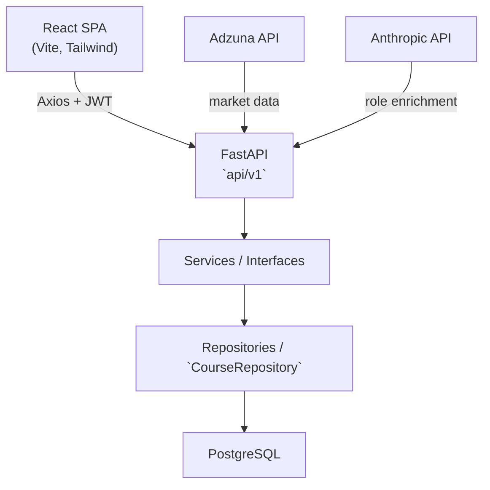
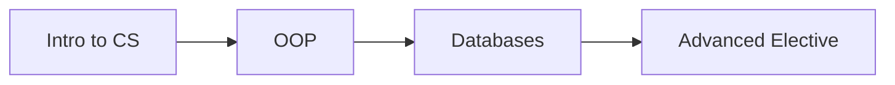

# Architecture & Design

AfekAdvisor is a full-stack web application that recommends academic elective
courses to students based on their academic history, personal preferences, and
live labour-market demand.

---

## 1. Tech stack 🚀

| Layer | Technology |
|-------|-----------|
| Frontend | React 19, TypeScript, Vite, Tailwind CSS, React Router, Axios |
| Backend | FastAPI, SQLAlchemy 2, Pydantic v2, Uvicorn |
| Database | PostgreSQL 15 |
| ML / NLP | scikit-learn local embeddings, cosine similarity |
| External APIs | Adzuna (live job listings), Anthropic (market-role enrichment) |
| Auth | JWT (HS256) via `python-jose`, bcrypt password hashing |
| Infra | Docker / Docker Compose, Nginx (static frontend) |

---

## 2. High-level architecture 🌐



The backend follows a **layered, dependency-injected design**:

- **`api/v1/*_router.py`** — thin HTTP endpoints; no business logic.
- **`services/`** — business logic behind `interfaces/` (e.g. `RecommendationService`,
  `ProfileService`), wired in `dependencies.py`.
- **`repositories/course_repository.py`** — all relational data access.
- **`dtos/`** — Pydantic request/response schemas.
- **`models.py`** — SQLAlchemy ORM models.

---

## 3. Data model (key tables) 📦

- **`students`** — credentials + `role` (`student` | `admin`, RBAC).
- **`student_profiles`** — target workload, degree, year, interested tracks &
  job roles (the inputs to personalization).
- **`student_course_history`** — courses a student has taken + grade.
- **`courses`** — catalog (code, name, category, credits, workload, skills,
  prerequisites, `feature_vector`, `avg_rating`).
- **`tracks`** — specialization tracks; many-to-many with courses.
- **`skills`**, **`job_roles`** — reference entities.
- **`industry_jobs`** — live Adzuna listings with `extracted_skills`,
  `feature_vector`, and **`search_role`** (scopes market data per target role).
- **`course_reviews`**, **`planned_courses`** — per-student user content.

---

## 4. Recommendation algorithm 🧠

For a student, `RecommendationServiceImpl` scores each elective/seminar course
with a weighted composite:

```text
score = 0.50 · track_match  +  0.35 · market_similarity  +  0.15 · rating
```

(When the student has no track preference, the track weight is redistributed.)

1. **Feature vector generation** — each course `feature_vector` is generated
   from catalog metadata, including course descriptions, explicit skill arrays,
   category tags, and track affinities. These elements are embedded together
   using a local `scikit-learn` pipeline so course semantics can be compared with
   market-derived vectors.
2. **Market similarity** — the student's target role drives a query to Adzuna;
   listings are embedded and averaged into a target role vector. Each course's
   `feature_vector` is compared by cosine similarity against that market signal.
3. **Track match** — whether the course belongs to a chosen specialization track
   (with dedicated seminar logic).
4. **Rating** — normalized average of student reviews.

**Cold-start / fallback behavior:**

- If a new course has no `avg_rating`, the rating term is treated as a neutral
  baseline and the algorithm relies more heavily on track and market similarity.
  This avoids penalizing fresh offerings while still surfacing strong matches.
- If Adzuna returns insufficient live data for a highly niche `search_role`, the
  market component degrades gracefully by using broader role-level embeddings and
  course skill similarity from the catalog. In that case, score weighting shifts
  toward track match and known curriculum affinities.

Already-passed courses are filtered out, missing prerequisites are surfaced
(and prerequisite courses injected), and results are cached per student.

---

## 5. Roadmap Generation & Prerequisite Resolution 🛣️

Academic prerequisites and track dependencies are modeled as a **Directed Acyclic
Graph (DAG)** where each course node points to the courses required before it.
This graph represents foundation-to-advanced relationships and ensures the system
can reason about prerequisite chains without cycles.



When a recommended advanced elective is selected, the system traverses the DAG to
identify any missing foundational courses. It performs a dependency walk from the
target course back through its prerequisites, checking the student's completed
history. Any unmet prerequisites are dynamically injected into the roadmap before
the target course, preserving the correct academic order.

Semester distribution logic assigns courses across future terms while respecting
`student_profiles.target_workload` and academic rules. The roadmap builder fills
semester buckets incrementally, grouping prerequisites and elective choices so
that each term remains within the student's desired workload. Prerequisites are
scheduled earlier than their dependents, and the planner avoids overloading a
single semester by spreading courses across multiple upcoming terms.

---

## 6. Authentication & authorization 🔒

- **Login** issues a signed JWT (`auth.py`, HS256) whose subject is the student
  id. The client sends it as `Authorization: Bearer <token>`.
- **`get_current_student_id`** derives identity from the verified token — never
  from a client-supplied id — closing the previous spoofable-header gap.
- **`verify_student_access`** guards `/profile/{student_id}` routes so a student
  can only reach their own data (403 otherwise).
- **`require_admin`** guards `/api/v1/admin/*` (role-based access control).
  Roles live in `students.role` and are extensible (e.g. a future `advisor`).

---

## 7. Per-role market data 🌍

`industry_jobs` is shared, so each row is tagged with `search_role`. Syncing a
role prunes only that role's stale rows (never the whole table), and the
recommender averages/keys skills **only on the user's target role**. Two users
with different goals (e.g. `Full-Stack Developer` vs `Data Scientist`) no longer
overwrite each other's market data.

---

## 8. Curriculum data: reference-data-as-code → DB source of truth 📚

The Afeka curriculum (mandatory/elective courses, tracks, skill mappings) is
defined as version-controlled Python catalogs under `services/*_catalog.py`.
These are an **initial seed only**: on first boot (empty DB) they are upserted
into PostgreSQL; afterwards **the database is the source of truth** and the
startup sync does not overwrite it (`ensure_catalog_synced`). Admins manage the
catalog at runtime via the admin API/UI, so curriculum changes no longer require
a code change and redeploy. (`CATALOG_FORCE_RESEED=1` forces a re-seed.)

This keeps the curriculum reproducible and reviewable in git while still being
fully editable in production.

---

## 9. Admin 🛠️

- **API** (`api/v1/admin_router.py`, admin-only): course create/update/delete and
  user role management (`GET /admin/users`, `PATCH /admin/users/{id}/role`).
- **UI** (`pages/Admin.tsx`): a protected page (visible only to admins) for
  managing courses and user permissions. Mutations invalidate the catalog and
  recommendation caches.

---

## 10. Caching ⚡

In-process caches keep expensive work off the hot path:

- `courses_list_cache` — full catalog list (invalidated on admin edits).
- `recommendation_cache` / `roadmap_cache` — per-student, TTL-based.
- `market_sync_cache` — throttles Adzuna syncs per role.

---

## 11. Testing 🧪

`server/tests/` runs against an **isolated SQLite database** (never the
production DB), using FastAPI's `TestClient`:

- `test_auth.py` — registration, login, JWT issuance/validation.
- `test_authorization.py` — a student cannot access another student's data.
- `test_admin.py` — non-admins are blocked; admin course CRUD and role management
  work end-to-end.

Run: `cd server && .venv/Scripts/python -m pytest tests/ -v`

---

## 12. Running & deployment 🚚

- **Local dev** — Postgres via `docker compose -f docker-compose.yml up -d`
  (host port 5433), backend `uvicorn main:app --reload`, frontend `npm run dev`
  (port 5173). See the root `README.md`.
- **Configuration** — `server/.env` (`DATABASE_URL`, `JWT_SECRET_KEY`,
  `ANTHROPIC_API_KEY`, Adzuna keys). See `server/.env.example`.
- **Production build** — the client Dockerfile runs `npm run build`
  (`tsc -b && vite build`) and serves the static bundle through Nginx; the
  backend image runs Uvicorn against the managed PostgreSQL instance.
